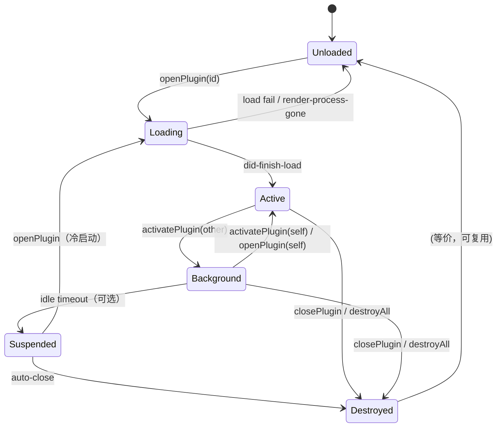

# eNest 插件生命周期与 API 面评审

> 对标 uTools 插件模型，审视 eNest 当前 PluginHost / pluginHandlers / pluginPreload 的实现。
> 范围：生命周期对比、性能取舍、API gap、建议状态机与最小落地改动。
> 代码位置：`src/main/plugin/PluginHost.ts`、`src/main/ipc/pluginHandlers.ts`、`src/preload/pluginPreload.ts`、`docs/engineering/PLUGIN_SPEC.md`。

---

## 1. uTools 生命周期对比

uTools 是「呼之即来、即用即走」的超级面板模型：插件是**短生命周期 UI 单元**，可被随时隐藏、卸载或杀死。

| 阶段 | uTools 行为 | 关键 API / 事件 | eNest 现状 |
|------|------------|----------------|-----------|
| **加载（安装）** | 下载/解压到本地，解析 `plugin.json`，注册 `features` 指令到搜索框 | 目录结构 + `plugin.json` | `PluginRegistry.scan()` 扫描 `~/eNest/plugins/{id}/{version}/`，`installFromDirectory` 解析 manifest。✅ 对等 |
| **打开（进入）** | 首次触发 feature → 创建插件页面，执行 `preload`，回调 `onPluginEnter({code,type,payload,from})` | `utools.onPluginEnter` | `PluginHost.openPlugin()` 创建独立 partition 的 `WebContentsView` 并 `loadURL`。**无 enter 事件 / 无 code·payload 传递**（features 仅存在于 manifest） |
| **切换（再进入）** | 已在后台则直接显示（不销毁），再次 `onPluginEnter`；`pluginSetting.single=false` 可多实例 | `pluginSetting.single`（默认 true） | `openPlugin` 已存在则 `activatePlugin`（仅 `setVisible`）。✅ 单例语义对等；**无多实例** |
| **切换 Tab（并存）** | 单插件面板模型，无多 Tab 并存 | — | eNest 特色：多 Tab 并存，`activatePlugin` 显隐切换。需要单独设计 |
| **退出到后台** | `outPlugin()` 默认**隐藏不销毁**；`onPluginOut(isKill=false)` | `utools.outPlugin()` | `activatePlugin` 仅隐藏（`setVisible(false)`），**无 out 事件通知插件** |
| **卸载（杀死）** | `outPlugin(true)` / 卸载 → 杀进程，`onPluginOut(isKill=true)`；重新打开走冷启动 | `utools.outPlugin(true)` | `closePlugin` → `webContents.close()` 立即销毁。✅ 对等；**无 out 事件** |
| **分离独立窗口** | `onPluginDetach`，插件可脱离主窗 | `utools.onPluginDetach` | ❌ 无（可后续做） |
| **数据同步** | `utools.db` 云端同步 + `onDbPull` | `db.put/get/remove` | 仅本地 JSON 文件 `storage.*`。无同步（合理，见 §3） |

### 关键差异总结

1. **uTools = 单面板 + 可隐藏**；eNest = **多 Tab 壳子**。eNest 的「关闭 Tab」更接近 uTools 的 `outPlugin(true)`（杀死），而「切走」对应隐藏。
2. uTools 用 **preload 放开 Node**（插件自带 `preload.js`，可 `require('fs')`）；eNest 用 **统一 `pluginPreload` + contextBridge + 权限白名单**，更安全但能力更窄。这是刻意取舍，建议保留。
3. uTools 的 **features / 匹配指令**（regex/img/files/window）是入口分发核心；eNest 的 `features` 目前只写在 manifest，**未接入壳子搜索/入口**。这是产品层缺口，非生命周期问题，但影响「打开」语义。
4. uTools 生命周期回调（`onPluginEnter/Out/Detach`）是插件感知自身状态的唯一通道；eNest **完全没有对应事件**，插件无法得知「我被切走/即将销毁」。

---

## 2. eNest 现状：PluginHost open/activate/close/destroy 是否合理

代码：`src/main/plugin/PluginHost.ts`

### 2.1 做得对的部分

| 机制 | 评价 |
|------|------|
| **每插件独立 partition** `persist:plugin-{id}` | ✅ cookie / localStorage / IndexedDB 完全隔离，串扰风险低 |
| **open 幂等**：已存在则 activate | ✅ 符合单例语义 |
| **activate 用 `setVisible` 而非销毁重建** | ✅ 切换成本低，状态（滚动、表单、内存）保留 |
| **close 立即 `webContents.close()`** | ✅ 及时回收渲染进程，避免幽灵 View 占内存 |
| **destroyAll 遍历 close** | ✅ 窗口/应用退出时干净收场 |
| **`byWcId` 反查** | ✅ IPC 侧可校验 sender 归属，防伪造 |
| **`render-process-gone` → shell event** | ✅ 崩溃可观测 |

### 2.2 问题与缺口

| # | 问题 | 位置 | 影响 | 建议 |
|---|------|------|------|------|
| 1 | **无「切走 / 卸载」生命周期事件** | `activatePlugin` / `closePlugin` | 插件无法保存草稿、暂停轮询、释放媒体 | 增加 `plugin:out` IPC 推送：切走发 `{isKill:false}`，销毁前发 `{isKill:true}`；preload 暴露 `onOut(cb)` |
| 2 | **无 enter 载荷**（code/cmd/payload） | `openPlugin(pluginId)` | features 无法路由到插件内逻辑 | `openPlugin(pluginId, enter?: {code, payload})`，preload 暴露 `onEnter` |
| 3 | **close 后无 partition 清理策略** | `closePlugin` | 分区数据永久保留（`persist:`），卸载插件时残留 | 「卸载插件」时调用 `session.fromPartition(...).clearStorageData()`；日常 close 不清（保数据） |
| 4 | **close 未从父 view 移除 child** | `closePlugin` | `BaseWindow.contentView` 可能残留已销毁 child 引用（Electron 多数情况可容忍，但不干净） | close 时 `win.contentView.removeChildView(view)`（若 API 可用） |
| 5 | **layoutAll 对隐藏 view 也 setBounds** | `layoutAll` | 小浪费；无害 | 可只 layout 可见项，或保持现状 |
| 6 | **activate 时重复 `addChildView`** | `activatePlugin` L148 | 每次激活都 addChildView，依赖 Electron 的 reparent 语义 | 仅在未挂载时 addChildView；或 setActive 置顶 API |
| 7 | **session.protocol 重复 handle** | `registerPluginProtocolForSession` | 同 partition 二次 open 时 `ses.protocol.handle` 可能报已注册 | open 前判断，或用 default session 统一 handle + rootPath 校验（现已部分这么做） |
| 8 | **`ui.resize` 空实现** | `pluginHandlers` | 声明了权限但 no-op | 明确「暂不支持」或对接 `window.minWidth/minHeight` 与内容区 |
| 9 | **storage JSON 全量读写** | `readStorage/writeStorage` | 高频 set 时 O(n) 序列化；并发 set 可能丢更新 | 内存缓存 + 去抖落盘；或换 better-sqlite3（项目已有依赖） |

### 2.3 结论

**open / activate / close / destroy 骨架合理**，partition 隔离与立即销毁策略正确。主要缺口是 **生命周期事件面**（enter/out）与 **卸载时的 storage 清理**，而非架构重写。不建议重写 PluginHost。

---

## 3. 性能议题

### 3.1 partition 复用

- 当前：`persist:plugin-{id}`，Electron 内部复用同一 `Session` 对象。**复用是对的**——避免重复初始化 cookie store / cache。
- 注意：`persist:` 前缀意味着数据落盘。若希望「关闭即清会话态」，应改用非持久 `plugin-{id}`（无 `persist:`）或显式 `clearStorageData`。**建议保持 persist**（插件 localStorage 是合法持久数据），会话态用新增的 `storage.session` 解决。

### 3.2 View 显隐 vs 销毁

| 策略 | 优点 | 缺点 | 适用 |
|------|------|------|------|
| **显隐（现状 activate）** | 切换快、状态保活 | 隐藏 view 仍占内存/GPU；多开时线性膨胀 | 用户会频繁切回的 Tab |
| **销毁（现状 close）** | 内存归零 | 重新打开 = 冷启动 | 用户明确关闭 |
| **超时冻结（推荐演进）** | 平衡：N 分钟不可见后销毁 | 需定时器 + 状态序列化 | Tab 数 > 阈值时启用 |

**建议**：短期保持现状；中期加「不可见超过 5–10 分钟自动 close」策略（可配置），并在 auto-close 前推 `plugin:out {isKill:true}` 让插件 flush。

### 3.3 关闭时 clearStorageData

- **日常 close 不要 clear**：插件 `localStorage` / partition storage 是用户数据。
- **卸载插件时必须 clear**：`PluginInstaller` / 设置页「卸载」路径应调用：
  ```ts
  await session.fromPartition(pluginPartition(id)).clearStorageData()
  ```
  同时删除 `~/eNest/data/plugin-storage/{id}.json`。
- eNest 自有 `storage.local`（JSON 文件）与 partition localStorage 是**两套**，卸载时两者都要清。文档中应写明。

### 3.4 懒加载

- 当前 `openPlugin` 即创建 View 并 `loadURL`，无预热。✅ 对首开延迟友好。
- 可选优化：市场页 hover 预热（创建 View 但 `setVisible(false)`），首点秒开。**非必须**，Tab 场景收益小于 uTools 面板场景。
- `pluginPreload` 是统一注入，无插件自带 preload，启动成本已很低。

---

## 4. 建议的完整生命周期状态机

### 4.1 状态定义

| 状态 | 含义 | 资源 |
|------|------|------|
| `Unloaded` | 未创建 View（未打开过 / 已关闭） | 无 |
| `Loading` | View 已创建，loadURL 进行中 | WebContents 创建 |
| `Active` | 可见且可交互 | 完整 |
| `Background` | 已加载但 `setVisible(false)` | View 保留 |
| `Suspended`（可选演进） | 不可见超时，View 销毁前快照 | 即将释放 |
| `Destroyed` | 显式关闭 / 卸载 / 应用退出 | 释放完毕 |

### 4.2 转移



### 4.3 事件面（建议新增，向插件 preload）

| 事件 | 时机 | 载荷 | 对标 uTools |
|------|------|------|------------|
| `onEnter` | 首次/再次打开完成 | `{ code?, payload?, from? }` | `onPluginEnter` |
| `onOut` | 切走后台 | `{ isKill: false }` | `onPluginOut(false)` |
| `onOut` | 即将销毁 | `{ isKill: true }` | `onPluginOut(true)` |
| `onDetach` | 分离独立窗（远期） | `{}` | `onPluginDetach` |

实现路径：`PluginHost.activatePlugin/closePlugin` → `sendShellEvent` 或直接 `view.webContents.send('plugin:event', ...)`；preload 订阅并回调。**本次不实现**，仅文档化为演进方向。

### 4.4 状态与 API 对应（当前实现映射）

| 当前 API | 实际状态变化 |
|----------|-------------|
| `openPlugin`（不存在） | Unloaded → Loading → Active |
| `openPlugin`（已存在） | Background/Active → Active |
| `activatePlugin` | Active ↔ Background |
| `closePlugin` | Active/Background → Destroyed（=Unloaded） |
| `destroyAll` | 全部 → Destroyed |

---

## 5. API Gap 分析

对标 uTools `utools.*` 与 Chrome extension 惯例。

### 5.1 统一持久化 API

| 能力 | uTools | eNest 现状 | Gap | 建议 |
|------|--------|-----------|-----|------|
| KV 持久化 | `dbStorage.setItem/getItem` | `storage.get/set/remove/clear`（JSON 文件） | 命名不同，能力对等 | ✅ 保留；文档对齐 `dbStorage` 语义 |
| 文档型 DB | `db.put/get/remove/allDocs`（可同步） | 无；有 better-sqlite3 依赖但未暴露给插件 | 缺文档模型 | **分级**：短期不做云同步；中期可暴露 `db.query` 只读 + `db.put` 到共享 sqlite（按 pluginId 表隔离） |
| 会话态 | 无显式 API（靠 JS 内存） | 无 | 插件切走/重载丢临时态 | **本次落地** `storage.session.*`（主进程内存 Map） |
| 加密存储 | `dbCryptoStorage` | 无 | 敏感配置 | 远期；可用 electron `safeStorage` 包一层 |
| 附件 | `db.postAttachment` | 无 | 大二进制 | 远期；可先走文件路径 API |

**结论**：
- **`storage.local` + `storage.session` 足够支撑 80% 插件**。
- **不需要**单独的 `storage.session` 权限键（复用 `storage.local`），降低 manifest 负担。
- **共享 sqlite / `db.query` 不是刚需**：eNest 是多 Tab 壳子而非 uTools 搜索面板，插件间数据共享场景少。若做，必须按 `pluginId` 建 schema 隔离，且默认拒绝跨插件读。
- **云同步不做**（与 uTools 商业模式绑定），本地 JSON/sqlite 已够。

### 5.2 统一信息提示

| 通道 | uTools | eNest 现状 | 问题 |
|------|--------|-----------|------|
| 系统通知 | `utools.showNotification(body, clickFeatureCode?)` | `enest.notify({title,body})` → Electron `Notification` | ✅ 有；可后续加 click 跳转 feature |
| 应用内 Toast | 无统一 API（插件自己画） | 壳子有 `toastStore`，**插件无法调用** | 插件只能用系统通知（重）或自绘（风格不一致） |

**建议**：新增 `zapi.ui.toast({ type?, message })`，由壳子 Toast 统一渲染。

- 主进程 `pluginHandlers` 收到后 `sendShellEvent({ type:'plugin-toast', message, toastType })`
- `useShellEvents` → `toastStore.push(message, type)`
- 权限：`ui.toast`（与其他 `ui.*` 一致）
- 与 `notify` 分工：**toast = 应用内轻提示（当前窗口可见时）**；**notify = 系统级（可后台）**。

### 5.3 其他缺口（分级建议）

| 优先级 | API | 对标 | 建议 |
|--------|-----|------|------|
| **P0（本次）** | `ui.toast` | 壳子统一轻提示 | 已实现 |
| **P0（本次）** | `storage.session` | 会话态 KV | 已实现 |
| **P1** | `clipboard.readImage` / `writeImage` | uTools `copyImage`；截图/OCR 类插件刚需 | Electron `clipboard.readImage/writeImage`，nativeImage → dataURL；权限复用 `clipboard.read/write` |
| **P1** | `clipboard.readFiles` | `utools.getCopyedFiles` | 读 `clipboard.readBuffer('FileNameW')` 跨平台成本高，可后置 |
| **P1** | `dialog.open` / `dialog.save` | `utools.showOpenDialog/showSaveDialog` | 主进程 `dialog.showOpenDialog`；权限 `dialog.open` |
| **P1** | `shell.openPath` / `showItemInFolder` | `utools.shellOpenPath` | 比 `openExternal` 更常用（打开下载结果）；需路径白名单 |
| **P2** | `shell.trashItem` | 移入回收站 | 高危，权限单独声明 |
| **P2** | `download` | 系统下载 | `session.downloadURL` + will-download 钩子；落盘到用户选择目录 |
| **P2** | `features.setFeature/removeFeature` | 动态指令 | 需壳子搜索框先落地 |
| **P2** | `ui.setSubInput` | uTools 子输入框 | eNest 已有 Tab 标题栏，可做「插件搜索条」 |
| **P3** | `window.detach` | 分离独立窗口 | 产品向 |
| **P3** | `db` 文档库 | 可同步 DB | 仅当出现跨设备诉求 |
| **不做** | `simulate` 模拟按键 / `ubrowser` | 自动化 | 面板场景，eNest 不需要 |
| **不做** | 插件自带 preload 放开 Node | uTools 模型 | 与 eNest 安全模型冲突 |

---

## 6. 本次最小落地改动

只做低风险、不重写 PluginHost 的部分：

1. **`ui.toast`**：preload → pluginHandlers → shell event → 壳子 Toast
2. **`storage.session`**：主进程内存 Map，get/set/remove/clear；插件销毁时清空
3. **文档**：PLUGIN_SPEC.md 增补权限与 API；本文档作为评审记录

### 涉及文件

| 文件 | 变更 |
|------|------|
| `src/shared/types/plugin.ts` | `PluginPermission` 增加 `'ui.toast'` |
| `src/shared/types/ipc.ts` | `ShellEventPayload` 增加 `plugin-toast` |
| `src/main/ipc/pluginHandlers.ts` | `ui.toast`、`storage.session.*`；导出 `clearPluginSession` |
| `src/main/plugin/PluginHost.ts` | `closePlugin` 调用 `clearPluginSession` |
| `src/preload/pluginPreload.ts` | `ui.toast`、`storage.session` API 面 |
| `src/renderer/hooks/useShellEvents.ts` | 处理 `plugin-toast` |
| `src/renderer/hooks/useToast.ts` | Toast 支持 type |
| `src/renderer/components/Toast.tsx` | type 样式 class |
| `src/renderer/styles/app.css` | toast-success/warn/error 样式 |
| `src/renderer/components/PluginDetailModal.tsx` | 权限文案 |
| `docs/engineering/PLUGIN_SPEC.md` | 文档 |

### 刻意不做

- 不重写 PluginHost
- 不实现 onEnter/onOut 事件总线（仅文档化）
- 不实现 db.query / clipboard 图片 / dialog / download
- 不改 partition 策略与 close 销毁策略

---

## 7. 关键建议汇总（给决策者）

1. **保留**「独立 partition + 显隐切换 + 关闭即销毁」骨架，它是对的。
2. **补齐生命周期事件**（onEnter/onOut）是下一阶段最高优先级——没有它，插件无法正确 flush 状态。
3. **卸载插件时**必须 `clearStorageData` + 删 JSON；日常 close 不清。
4. **API 面**走「壳子统一渲染」路线：toast 用壳子，系统通知用 Electron；避免插件自绘 UI 碎片化。
5. **storage.session** 解决会话态；**不要**过早引入云同步 DB。
6. **clipboard 图片 + 文件对话框**是 P1 缺口，覆盖面广、实现成本低。
7. features/搜索入口是产品问题，与生命周期解耦，可并行推进。
