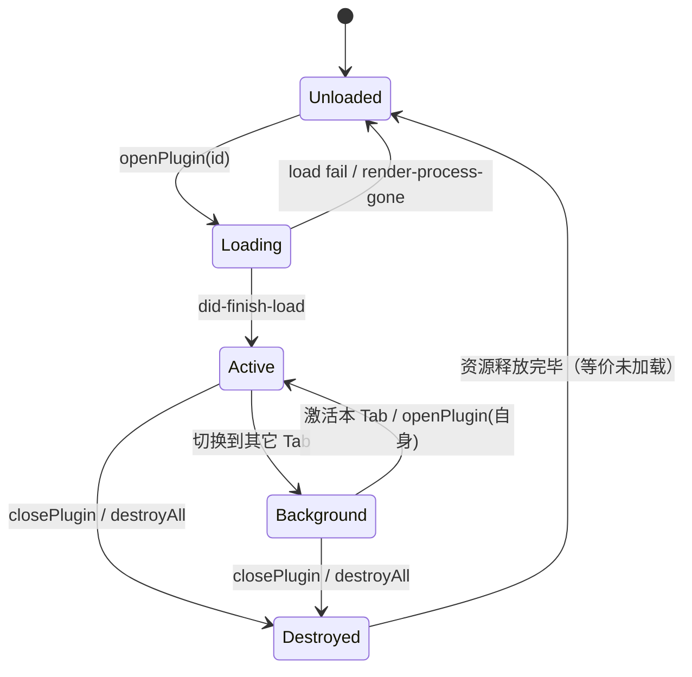

# 生命周期

插件在壳子中以 **原生 `WebContentsView`** 存在：创建加载 → 可见 / 切走 → 关闭销毁。**无 LRU 保活**，关 Tab 即回收渲染进程；切走仅 `setVisible(false)`，状态保活。

---

## 状态机



ASCII 等价视图：

```text
                    openPlugin
   Unloaded ──────────────────► Loading
       ▲                          │
       │                 did-finish-load
       │                          ▼
       │                        Active ◄────────┐
       │                          │             │ activatePlugin(self)
       │            activatePlugin(other)       │
       │                          ▼             │
       │                      Background ───────┘
       │                          │
       │         closePlugin / destroyAll
       │                          ▼
       └──────────────────── Destroyed
```

| 状态 | 含义 | 资源占用 |
|------|------|----------|
| `Unloaded` | 未创建 View（从未打开 / 已关闭） | 无 |
| `Loading` | View 已创建，`loadURL` 进行中 | WebContents 创建中 |
| `Active` | 可见且可交互 | 完整 |
| `Background` | 已加载但 `setVisible(false)` | View / 进程保留 |
| `Destroyed` | 显式关闭 / 卸载 / 应用退出 | 已释放 |

> 源码位置：`src/main/plugin/PluginHost.ts` · `src/main/ipc/pluginHandlers.ts` · `src/preload/pluginPreload.ts`  
> 深度评审：`docs/engineering/LIFECYCLE_REVIEW.md`

---

## 事件时间线

```text
首次打开
  openPlugin
    → 创建 partition / View / 注入 preload
    → loadURL
    → did-finish-load
    → 主进程推送 plugin:lifecycle { event: 'enter', tabId, code?, payload? }
    → preload 派发给 onEnter 回调

切到其它 Tab
  activatePlugin(other)
    → setVisible(false)
    → plugin:lifecycle { event: 'out', isKill: false }
    → onOut

切回本 Tab
  activatePlugin(self) / openPlugin(self)
    → setVisible(true)
    → plugin:lifecycle { event: 'enter', ... }
    → onEnter（再次触发）

关闭 Tab / 卸载 / 退出
  closePlugin
    → plugin:lifecycle { event: 'beforeClose', reason }
    → onBeforeClose
    → preload 自动回 ack（主进程最多等 300ms）
    → plugin:lifecycle { event: 'destroy' }
    → onDestroy（best-effort）
    → webContents.close()
    → clearPluginSession(pluginId)   // 丢弃 storage.session
    → 移除 View
```

---

## 插件侧 API

```js
const api = window.enest || window.zapi

// 进入：首次加载完成 + 每次 Tab 激活
const offEnter = api.onEnter(({ tabId, code, payload }) => {
  // code 对应 features[].code；payload 为透传数据
  resumeUi()
})

// 切到后台（不销毁）
api.onOut(() => {
  pauseHeavyWork()
})

// 即将销毁：可同步 flush
api.onBeforeClose(({ reason }) => {
  // reason: 'tab-close' | 'uninstall' | 'app-quit'
  api.storage.session.set('closed-by', reason)
})

// 关闭已开始（尽力而为；清理请放 onBeforeClose）
api.onDestroy(() => {
  console.log('destroyed')
})

// 同步身份工具（不走 IPC）
console.log(api.getPluginId())
console.log(api.getEnterCode())
```

所有 `onXxx` 返回 **取消订阅函数**：

```js
const off = api.onEnter(handler)
// 不再需要时
off()
```

---

## Handler 侧实现参考

### PluginHost：打开与激活（概念节选）

```ts
// openPlugin — 幂等：已存在则激活
async openPlugin(pluginId: string, enter?: PluginEnterPayload) {
  const existing = this.views.get(pluginId)
  if (existing) {
    this.activatePlugin(pluginId)
    this.sendLifecycle(pluginId, {
      event: 'enter',
      tabId: toTabId(pluginId),
      code: enter?.code,
      payload: enter?.payload
    })
    return
  }
  // 1. partition 隔离
  const ses = session.fromPartition(`persist:plugin-${pluginId}`)
  // 2. 注册 enest://plugin/{id} 协议
  // 3. new WebContentsView({ webPreferences: { preload: pluginPreloadPath, ... } })
  // 4. loadURL(development.main ?? enest://plugin/{id}/{main}?pid=..&code=..)
  // 5. did-finish-load 后 setBounds + setVisible(true) + 广播 enter
}

// activatePlugin — 仅显隐，不销毁
activatePlugin(pluginId: string) {
  const view = this.views.get(pluginId)
  if (!view) return
  for (const [id, v] of this.views) {
    const active = id === pluginId
    v.setVisible(active)
    if (!active) {
      this.sendLifecycle(id, { event: 'out', isKill: false })
    }
  }
  this.sendLifecycle(pluginId, {
    event: 'enter',
    tabId: toTabId(pluginId)
  })
}

// closePlugin — 立即销毁
async closePlugin(pluginId: string, reason: PluginCloseReason = 'tab-close') {
  const view = this.views.get(pluginId)
  if (!view) return
  this.sendLifecycle(pluginId, { event: 'beforeClose', reason })
  // 等待 ack，最多 300ms
  await this.waitForBeforeCloseAck(pluginId, 300)
  this.sendLifecycle(pluginId, { event: 'destroy' })
  view.webContents.close()
  clearPluginSession(pluginId) // PluginSessionStore
  this.views.delete(pluginId)
}
```

### preload：派发与自动 ack（节选）

```ts
ipcRenderer.on(IpcChannels.PluginLifecycle, (_e, message) => {
  switch (message.event) {
    case 'enter':
      emit('enter', { tabId: message.tabId, code: message.code, payload: message.payload })
      break
    case 'out':
      emit('out', { isKill: false })
      break
    case 'beforeClose':
      emit('beforeClose', { reason: message.reason })
      // 同步回调跑完立即确认；主进程最多等 300ms
      try {
        ipcRenderer.send(IpcChannels.PluginLifecycleAck, { event: 'beforeClose' })
      } catch { /* 通道可能已随销毁关闭 */ }
      break
    case 'destroy':
      emit('destroy', undefined)
      break
  }
})
```

### 插件页：推荐 pause / resume 骨架

```js
const api = window.enest || window.zapi
let timer = null

function resume() {
  if (timer) return
  timer = setInterval(tick, 1000)
}

function pause() {
  if (!timer) return
  clearInterval(timer)
  timer = null
}

api?.onEnter(() => resume())
api?.onOut(() => pause())
api?.onBeforeClose(() => {
  pause()
  // 同步或 fire-and-forget 持久化
})
```

---

## 打开（Open）

触发：市场卡片、已安装列表、开发者加载本地目录。

主进程 `PluginHost` 步骤：

1. 解析安装路径；未安装则从示例 / 目录安装
2. `session.fromPartition('persist:plugin-' + id)` 创建隔离会话
3. 为该 session 注册 `enest://plugin/{id}` 协议映射
4. `new WebContentsView`，注入统一 `pluginPreload`（暴露 `window.enest` / `zapi`）
5. 加载 URL：优先 `development.main`（开发态），否则 `enest://plugin/{id}/{main}`
   - query 携带 `pid` 与可选 `code`，便于 preload 同步解析
6. `setBounds` 铺到内容区（标题栏 + 插件条之下）
7. 推送 `shell:event` → `plugins-changed`，壳子出现 Tab
8. `did-finish-load` 后注入主题 Token（`themeAware`）并广播 `enter`

加载失败推送 `plugin-error`（见 [错误码](errors.md)）。

---

## 切换（Activate）

- 多 Tab 并行：每个插件独立 View / 进程 / partition
- 激活仅改 `setVisible(true/false)`，**不销毁**不可见 Tab
- 窗口 resize 时 `layoutAll()` 重算所有插件 bounds
- 切走插件收到 `onOut({ isKill: false })`；切回再次收到 `onEnter`

---

## 重载（Reload）

开发者控制台「热重载」或 IPC `shell:reload-plugin`：

```text
webContents.reload()  →  重新加载 development.main 或 enest:// 入口
```

- 修改 `plugin.json` **权限** 后建议关 Tab 重开，确保清单重新读取
- Vite HMR 本身不需要壳子 reload；只在 preload / 权限变更时需要

---

## 关闭 / 卸载

| 动作 | reason | 行为 |
|------|--------|------|
| 关闭 Tab | `tab-close` | `beforeClose` → `destroy` → `webContents.close()` → 清 session KV |
| 关闭窗口 / 退出 | `app-quit` | `destroyAll()` 销毁全部插件 View |
| 卸载插件 | `uninstall` | 另应清理 partition 数据 + 删除 `plugin-storage/{id}.json` |

**设计取舍**：关闭即销毁，内存可预期。日常关闭 **不清除** partition localStorage / `storage.local`（用户数据保留）；**卸载时**才清理两者。

---

## 与页面原生事件配合

壳子生命周期与 DOM 事件互补：

```js
// 页面被隐藏/卸载前（浏览器原生）
window.addEventListener('pagehide', () => {
  // 同步或 sendBeacon；勿依赖 unload 异步完成
})

// Tab 切换可见性
document.addEventListener('visibilitychange', () => {
  if (document.hidden) pause()
  else resume()
})
```

!> 壳子不保证插件进程常驻。**重要状态请写 `enest.storage`，不要只放内存。** `storage.session` 会在关 Tab 时被清空。

---

## 与 uTools 对照

| 阶段 | uTools | eNest |
|------|--------|-------|
| 进入 | `onPluginEnter` | `onEnter` |
| 切走 | `onPluginOut(false)` | `onOut({ isKill: false })` |
| 杀死 | `onPluginOut(true)` | `onBeforeClose` + `onDestroy` |
| 分离窗口 | `onPluginDetach` | 远期，未实现 |
| 单例 | `pluginSetting.single` 默认 true | 默认单例，无多实例 |
| 多面板 | 单面板 + 隐藏 | **多 Tab 并存**（eNest 特色） |

---

## 相关文档

- [zapi API](api.md) — onEnter / onOut 等完整签名
- [调试与热更新](debug.md)
- [错误码](errors.md)
